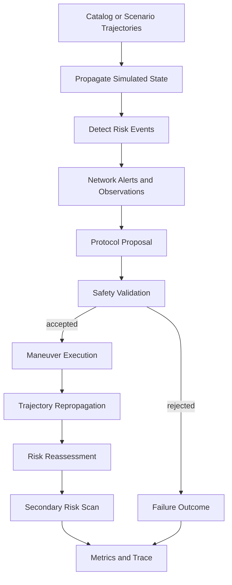

# Protocol Arena

Themis is an experimental research and benchmarking platform for distributed autonomous coordination. It is not intended for operational conjunction assessment, spacecraft command, or flight-safety decisions.

Space traffic management is the first domain. The protocol arena connects conjunction detection to agent coordination, maneuver proposal, safety validation, simulated trajectory modification, risk reassessment, and structured trace output.

## Closed-Loop Architecture



The closed loop is:

1. Build deterministic scenario trajectories.
2. Detect initial conjunction risk.
3. Deliver risk alerts through the constrained network.
4. Give protocols only their declared information view.
5. Generate maneuver proposals.
6. Validate proposals independently of protocol logic.
7. Execute accepted maneuvers exactly once.
8. Repropagate the affected simulated trajectory.
9. Reassess the original risk over a post-maneuver horizon.
10. Scan for secondary conjunctions against third parties.
11. Aggregate metrics from state transitions and trace events.
12. Save a JSON trace that can be inspected later.

## State Ownership

- Physical truth lives in `WorldState.trajectories`.
- Original source trajectories live in `WorldState.original_trajectories` and are copied before maneuver execution.
- Agent belief lives in `SatelliteAgentState`, including known risk events, known neighbors, accepted maneuver, and maneuver history.
- Protocol state is represented by restricted `ProtocolContext` views.
- Maneuver lifecycle state lives in `ManeuverProposal`.
- Run history lives in `SimulationTrace`.

This separation prevents protocols from silently mutating trajectories and keeps original trajectory data intact.

## Maneuver Model

The first maneuver model is a simplified impulsive velocity change in a local linear benchmark frame.

Units:

- position: kilometers
- velocity: kilometers per simulation step
- delta-v: kilometers per simulation step
- fuel cost: equal to delta-v magnitude in this benchmark model
- mission disruption score: `0.1 * delta-v magnitude`

The maneuver generator searches a deterministic candidate set across positive and negative x, y, and z directions and configured magnitude bounds. It keeps candidates that improve the projected separation over the reassessment horizon. This is not a high-fidelity mission-design optimizer.

## Propagation Assumption

Closed-loop benchmark scenarios use `LinearTrajectory`, not TLE mutation. Applying a maneuver creates a new post-maneuver trajectory segment by changing the simulated velocity from the execution time forward.

This is a defensible short-horizon benchmark abstraction for testing coordination behavior. It is intentionally replaceable with a higher-fidelity two-body or perturbed propagator later.

## Safety Validation

The validator is separate from protocol logic. It checks:

- valid current risk event
- proposal before deadline
- execution before deadline
- delta-v bounds
- sufficient fuel
- no incompatible accepted maneuver
- duplicate proposal prevention
- target-risk improvement
- secondary-risk acceptability

Validation returns a structured result with a reason code, explanation, evaluated constraints, estimated post-maneuver risk, estimated fuel cost, and secondary-risk findings.

## Protocol Responsibilities

Protocols propose actions. They do not execute maneuvers or mutate trajectories.

- `centralized` has global risk visibility and selects one satellite in each risky pair, preferring lower mission priority and then higher available fuel.
- `greedy` uses local risk alerts delivered through the network and proposes based on each agent's known risks.

Future protocols can integrate by implementing the proposal interface and accepting a restricted protocol context.

## Trace And Replay

Run output includes:

- run ID
- scenario ID
- protocol
- seed
- configuration snapshot
- ordered events
- maneuver proposals
- validation decisions
- execution outcomes
- risk reassessments
- final metrics

Run a closed-loop scenario:

```bash
python -m src.simulation.runner run --scenario closed_loop_resolved --protocol centralized --seed 42 --output results/closed_loop_run.json
```

Inspect a saved trace:

```bash
python -m src.simulation.runner replay results/closed_loop_run.json
```

Replay is currently textual trace inspection, not full state reconstruction or visualization.

## Example Scenarios

- `closed_loop_resolved`: one maneuver resolves the initial conjunction.
- `closed_loop_insufficient_fuel`: proposed maneuver is rejected by validation.
- `closed_loop_late_response`: network latency prevents greedy coordination before the deadline.
- `closed_loop_packet_loss`: packet loss prevents greedy coordination.
- `closed_loop_secondary`: an accepted maneuver creates a secondary conjunction with a third satellite.
- `closed_loop_protocol_difference`: centralized and greedy protocols choose different maneuvering satellites.
- `closed_loop_execution_error`: deterministic magnitude error is applied during execution.

## Metrics

Closed-loop runs report safety, coordination, resource, communication, and timing metrics, including:

- original, resolved, unresolved, worsened, and secondary conjunctions
- minimum pre- and post-maneuver separation
- safety validation failures
- coordination attempts, agreements, timeouts, duplicate proposals, and fallbacks
- total delta-v used
- delta-v per resolved conjunction
- mission disruption cost
- per-agent maneuver burden
- remaining fuel by agent
- messages sent, delivered, dropped, and delayed beyond usefulness
- detection-to-decision and decision-to-execution timing
- wall-clock runtime

## Known Limitations

- The closed-loop propagator is linear and synthetic.
- Maneuver execution is a benchmark abstraction, not spacecraft dynamics.
- Risk is distance-threshold based, not probabilistic collision assessment.
- Maneuver validation uses short-horizon separation checks.
- Replay is trace inspection, not deterministic state rehydration.
- There is no dashboard, reinforcement learning, LLM-agent behavior, auction protocol, gossip protocol, or high-fidelity perturbation model yet.
