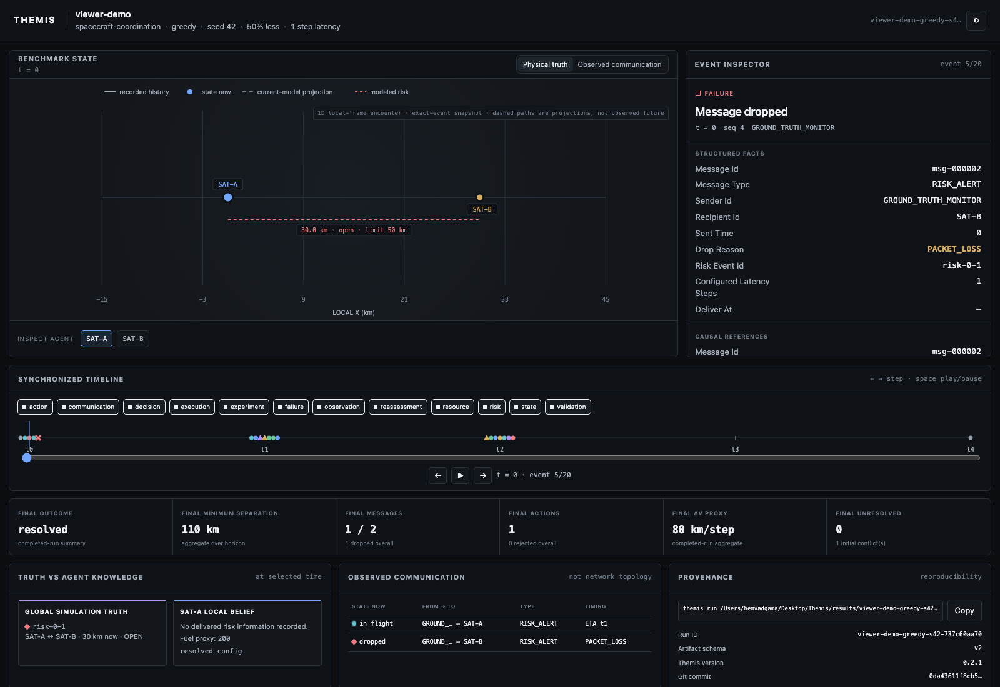
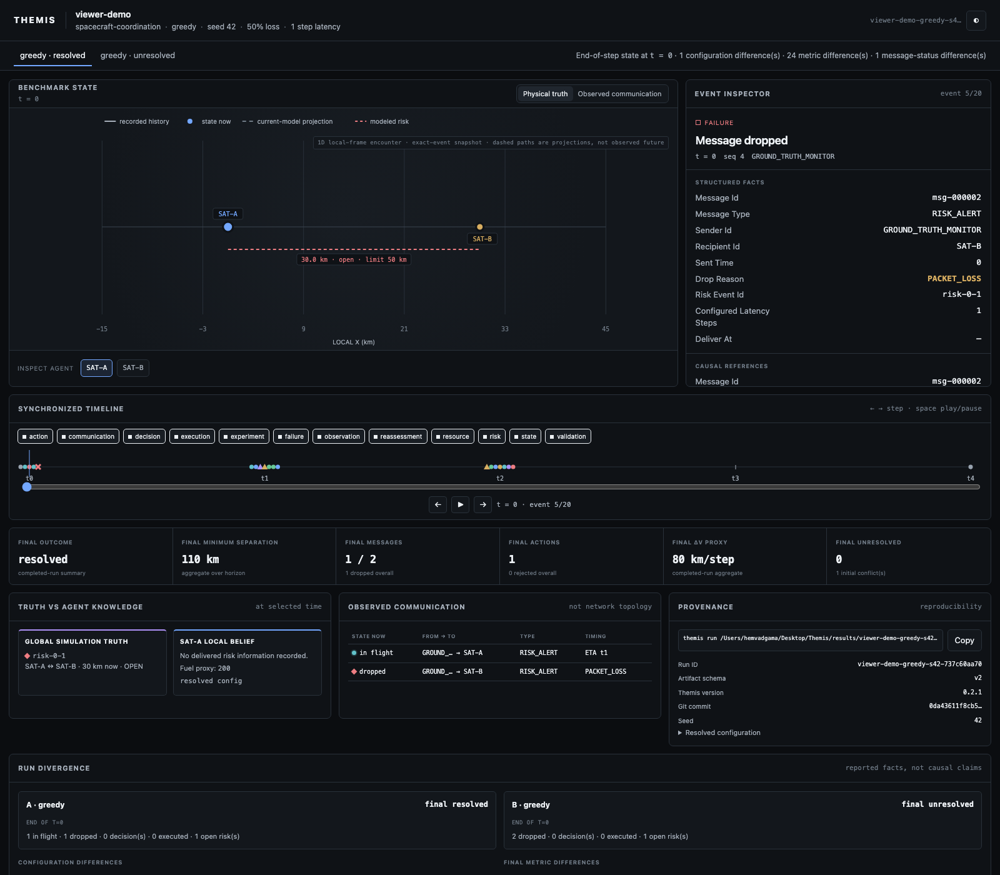
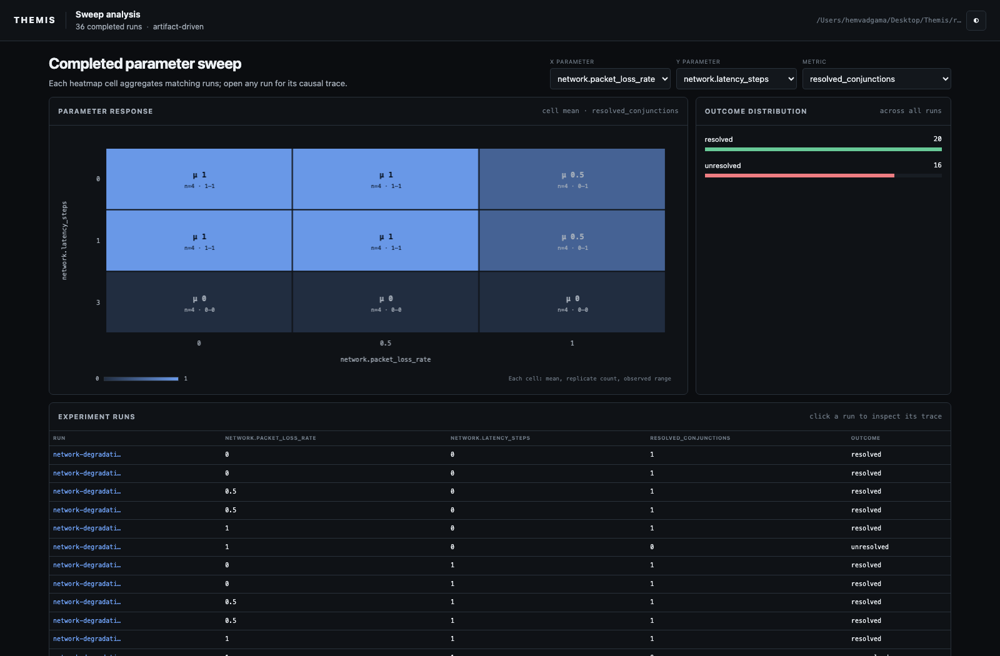

# Experiment viewer

The Themis viewer is a read-only visual debugger for completed experiments. It consumes the same resolved configuration, summary, metrics, metadata, and event trace written by `themis run`. It contains no simulation engine and cannot alter a scientific result.

## Launching

Run an experiment, then pass the printed artifact directory to the viewer:

```bash
themis run examples/viewer-demo.toml
themis view results/viewer-demo-greedy-s42-<hash>
```

The viewer binds to `127.0.0.1`, chooses an available port, and opens the default browser. Use `--no-open`, `--host`, or `--port` when needed. Stop it with Ctrl-C.

For two runs:

```bash
themis view results/<run-a> --compare results/<run-b>
```

A directory containing `comparison.json` or `aggregate.json` is detected as a comparison or sweep automatically.

## Single-run layout



The primary screen is organized around simulation time:

1. **Benchmark state** reconstructs the physical model through the exact selected event. Solid paths are recorded history, points are current state, and dashed paths are projections made from the trajectory known at that event. Later trajectory changes are never drawn early. One-dimensional scenarios use an explicit 1D encounter view rather than implying unmodeled Y geometry. It intentionally does not depict Earth or imply orbital fidelity.
2. **Event inspector** translates the selected event into structured facts and links events sharing message, risk, or maneuver identifiers. Raw JSON remains available for auditing.
3. **Synchronized timeline** categorizes risk, communication, observation, decision, validation, execution, resource, and reassessment events. Click, scrub, play, use arrow keys, or filter categories. Animation is optional; seeking is immediate.
4. **Outcome strip** is explicitly labeled as the final completed-run summary. It remains visible for context but is not presented as state known at the selected event.
5. **Truth vs agent knowledge** deliberately separates authoritative simulation risk state from the selected agent's recorded local belief.
6. **Observed communication** reconstructs each message as sent/in flight, delivered, delayed, or dropped through the selected event sequence. A message cannot appear delivered before its delivery event. It is not labeled as network topology because the simulator does not model a persistent graph.
7. **Provenance** shows schema and software versions, seed, git commit, resolved TOML, and a copyable reproduction command.

The physical-truth/observed-communication toggle changes the central visualization. Selecting a message row jumps to its event. Selecting a related causal stage navigates through the action lifecycle.

## Trace and causal linkage

Artifact schema version 2 adds stable presentation facts without exposing mutable Python objects:

- deterministic message IDs, sender, recipient, send/delivery times, latency, and drop reason;
- agent belief/resource snapshots around delivered risk alerts, action acceptance, and execution;
- protocol visibility, agent views, visible risks, built-in policy selection rationale, and resulting proposal IDs;
- risk, message, and maneuver references on lifecycle events;
- resource-proxy before/after/change values; and
- explicit event category, actor, and affected entity IDs.

Existing uppercase event names remain stable. The viewer normalizes version-1 artifacts, inferring causal links where the old trace contains enough evidence. Derived legacy knowledge is labeled as derived rather than recorded.

## Comparison



Comparison mode loads two ordinary run directories. It displays only differing configuration values, final metric differences with `B − A` deltas, outcomes, and message/decision/action/risk state at the end of the synchronized simulation step. Tabs switch the exact-event central state, timeline, and inspector between runs without changing the selected time. The end-of-step label makes the cross-run alignment rule explicit when runs contain different event sequences within a step.

The viewer reports divergence facts. It does not claim that a differing configuration caused a differing outcome.

For a deterministic communication demonstration, compare runs produced by:

```bash
themis run examples/viewer-demo.toml
themis run examples/viewer-demo-blackout.toml
themis view results/<viewer-demo-run> --compare results/<blackout-run>
```

## Sweep analysis



Opening a completed sweep shows:

- a selectable two-parameter heatmap using mean metric values across matching runs, with replicate count, observed range, and an explicit color scale in every cell;
- outcome distribution;
- a compact experiment-cell table; and
- links from cells to their underlying run viewer.

Sweep creation remains TOML/CLI-only. The viewer is not a chart builder or experiment editor. It loads underlying run details on demand so larger sweeps do not eagerly parse every event trace.

## Accessibility and performance

The viewer supports keyboard event stepping, timeline scrubbing, clear focus states, non-color-only event shapes/status labels, dark and light themes, reduced-motion preferences, and immediate seeking. The timeline uses one canvas rather than one DOM node per event. Sweep traces are loaded only when opened.

## Limitations

- Version-1 artifacts lack recorded protocol inputs and full agent state transitions; some message/risk linkage is inferred.
- Agent belief snapshots currently change when modeled risk alerts arrive. Other observation and neighbor-state transitions are not yet emitted by the closed-loop benchmark.
- The state graphic represents the actual simplified local linear frame, not an orbit around Earth. Dashed projection paths are extrapolations of the current recorded trajectory, not observed future state.
- The viewer cannot reconstruct state absent from artifacts and does not re-run the simulator.
- Comparison aligns integer simulation steps; it does not establish causal attribution or statistically align different scenario semantics.
- Sweep heatmaps aggregate existing cells but do not calculate confidence intervals or significance tests.
